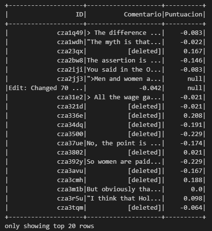
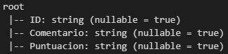
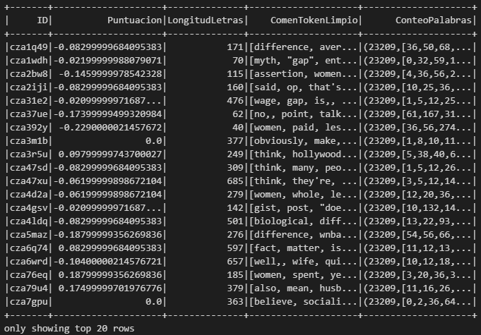
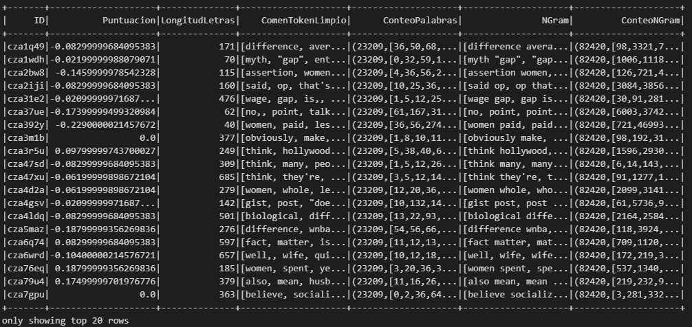
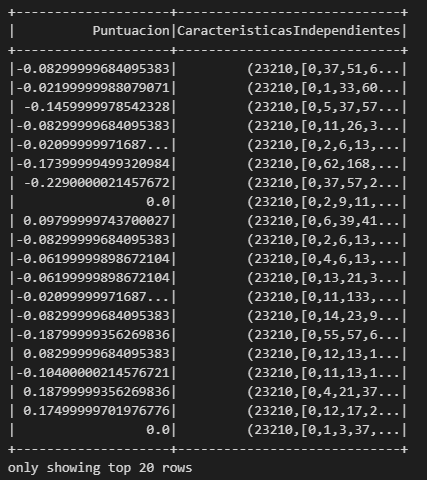
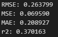
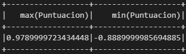
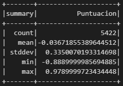

# **Proyecto NLP**

-----
### Exte proyecto va a consistir en el análisis, exploración de datos y creación de un modelo de machine learning para predecir la puntuacion de toxicidad en un comentario de reddit. Dentor de todo el proyecto se ha usado la librería de PySpark que permite el procesamiento distribuido de datos haciendo más eficientes todas las operaciones de analisis y machine learning que se realizan. Este es un proyecto de NLP por lo que se han usado las herramientas y librerías correspondientes con el lenguaje de Python.


-----

### Organización de carpetas: 

* scr/
    * data/: Contiene los archivos usados en el proyecto.
    
    * Images /: Contiene imágenes usadas en este archivo Markdown.

    * notebooks/: son archivos jupyter notebook usados en todo el proceso.

------

### Fuente: [Kaggle](https://www.kaggle.com/datasets/estebanmarcelloni/ruddit-papers-comments-scored)

------

### En este proyecto de pueden apreciar conocimientos en:

* Python
* Spark
* Big Data
* NLP
* Supervised Learning
* Regression Models
* Functional Programming

------

## **Importación de los datos**

#### Antes de nada abrimos los archivos correspondientes con pyspark.

```python
spark = SparkSession.builder.appName("ProyectoNLPSpark").getOrCreate()
data = spark.read.csv('../data/ruddit_comments_score.csv', header=True, inferSchema=True, sep = ",", multiLine=True)
data = data.withColumnRenamed("comment_id", "ID").withColumnRenamed("body", "Comentario").withColumnRenamed("score", "Puntuacion")
data.show()
```

#### Estos son los datos con los que vamos a trabajar.

#### Este es el esquema del dataframe.


## **Limpieza y transformación de datos**
#### Realizamos una limpieza sobre los datos para eliminar los registros invalidos y vamlores nulos.
```python
data = data.withColumn("Puntuacion", data["Puntuacion"].cast("float"))
data = data.dropna()
data = data.filter(data["Comentario"] != "[deleted]")
data = data.rdd.map(lambda x: (x[0],x[1][1:] if (x[1][0] == '"') else x[1],x[2])).toDF()
data = data.rdd.map(lambda x: (x[0],x[1][:-1] if (x[1][-1] == '"') else x[1],x[2])).toDF()
data = data.rdd.map(lambda x: (x[0],x[1][1:] if (x[1][0] == '>') else x[1],x[2])).toDF()
data = data.rdd.map(lambda x: (x[0],x[1][1:] if (x[1][0] == ' ') else x[1],x[2])).toDF()
data = data.rdd.map(lambda x: (x[0],x[1][:-1] if (x[1][-1] == ' ') else x[1],x[2])).toDF()
data = data.rdd.map(lambda x: (x[0],x[1][:-1] if (x[1][-1] == '.') else x[1],x[2])).toDF()
data = data.rdd.map(lambda x: (x[0],x[1].replace('""', '"'),x[2])).toDF()
data = data.rdd.map(lambda x: (x[0],x[1].replace('\n', ''),x[2])).toDF()
data = data.rdd.map(lambda x: (x[0],x[1].replace('\t', ''),x[2])).toDF()
data = data.withColumnRenamed("_1", "ID").withColumnRenamed("_2", "Comentario").withColumnRenamed("_3", "Puntuacion")
```
#### Así es como nos quedan nuestros datos luego de realizar la limpieza de los valores nulos, los comentarios eliminados y la eliminación de caracteres que no aportan información. Esto para que nuestro modelo aprenda mejor y con datos más útiles.


#### Añadimos una nueva columna con la longitud de los comentarios para aportar información.

```py
data = data.withColumn("LongitudLetras", length(data["Comentario"]))
```

#### Para preparar los datos para el modelo necesitamos tokenizar el texto(Poner las palabras de cada comentairio en una lista) y seguir con las demás transformaciones.Creamos una nueva columna llamada "ComenToken".

```py
data = Tokenizer(inputCol="Comentario", outputCol="ComenToken").transform(data).drop("Comentario")
```
#### Ahora vamos a eliminar las Stop-Words. Que son las palabras innecesarias o que no portan tanta información como otras como pueden ser los determinantes, preposiciones o pronombres.

#### Para ello hemos cogido una lista de palabras de la librería nltk enfocada a NLP. Usaremos esta lista de palabras para buscar en cada comentario y eliminar las palabras que coincidan.Creamos una nueva columna llamada "ComenTokenLimpio".
```py
stopwords.words('english')[:10]
['i', 'me', 'my', 'myself', 'we', 'our', 'ours', 'ourselves', 'you', "you're"]
```

```py
data = StopWordsRemover(stopWords=stopwords.words('english'), inputCol="ComenToken", outputCol="ComenTokenLimpio").transform(data).drop("ComenToken")
```

#### Luego de haber hecho todo esto vamos a usar un método llamado Count Vectorizer para convertir texto a un formato numérico. Para ello contaremos el numero de veces que aparece una palabra entre todas las palabras de todos los comentarios. Creamos una nueva columna llamada "ConteoPalabras".

```py
data = CountVectorizer(inputCol="ComenTokenLimpio", outputCol="ConteoPalabras").fit(data).transform(data)
```


#### Ahora antes de crear el modelo vamos añadir una nueva columna gracias al método de N-grams que consiste en crear grupos de 2, 3 o más palabras haciendo que el modelo pueda aprender en base a grupos de palabras en vez de con palabras sueltas lo que puede hacer mejorar la comprensión del texto para el modelo y aumentar su rendimiento. Crearemos una nueva columna llamada "NGram".

```py
data = NGram(n = 2, inputCol="ComenTokenLimpio", outputCol="NGram").transform(data)
```

#### Le aplicamos un Count Vectorizer.
```py
data = CountVectorizer(inputCol="NGram", outputCol="ConteoNGram").fit(data).transform(data)
```


#### Ahora sí estamos en condiciones de crear el modelo pero antes necesitamos transformar los datos en un formato comprensible para Spark usando VectorAssembler. Creamos la columna llamada "CaracteristicasIndependientes".

```py
feature_assembler = VectorAssembler(inputCols=["LongitudLetras", "ConteoPalabras"], outputCol="CaracteristicasIndependientes")
output = feature_assembler.transform(data)
FinalData = output.select("Puntuacion","CaracteristicasIndependientes")
```

#### Cogemos solo las dos columnas que nos interesan, la de "Puntuacion", la variable objetivo, y la de "CaracteristicasIndependientes", la variable predictora.



## Creación del modelo y predicción de datos.
#### Creamos el modelo y fividimos los datos en train y test.

```py
train, test = FinalData.randomSplit([0.75, 0.25])
Model1 = RandomForestRegressor(featuresCol = "CaracteristicasIndependientes", labelCol="Puntuacion")
Model1 = Model1.fit(train)
```
#### Realizamos la predicción de los valores de test y comprobamos su eficacia.
```py
predicciones = Model1.transform(test)
print("RMSE: %f" % RegressionEvaluator(labelCol="Puntuacion", predictionCol="prediction", metricName="rmse").evaluate(predicciones))
print("MSE: %f" % RegressionEvaluator(labelCol="Puntuacion", predictionCol="prediction", metricName="mse").evaluate(predicciones))
print("MAE: %f" % RegressionEvaluator(labelCol="Puntuacion", predictionCol="prediction", metricName="mae").evaluate(predicciones))
print("r2: %f" % RegressionEvaluator(labelCol="Puntuacion", predictionCol="prediction", metricName="r2").evaluate(predicciones))
```



#### Vamos a ver si ha sido un buen modelo o no dependiendo de la dispersión de datos que tengamos.

```py
data.select([max(data["Puntuacion"]), min(data["Puntuacion"])]).show()
```


```py
data.select("Puntuacion").describe().show()
```


#### Vemos que las medidas que nos dan las metricas del modelo son considerablementemas bajas que la desviación estándar(En este caso vamos a centrarnos solo en la desviación estandar.) teniento en cuenta los maximos y minimos de nuestros datos por lo que podemos decir que el modelo predice con bastante exactitud.

